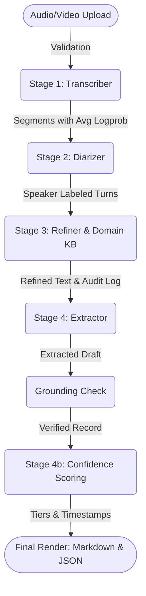
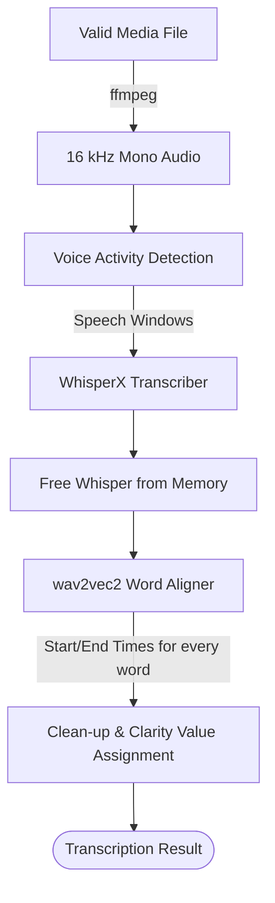
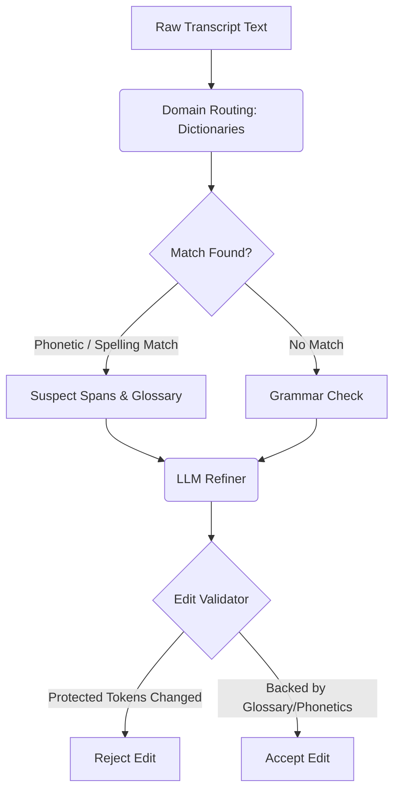
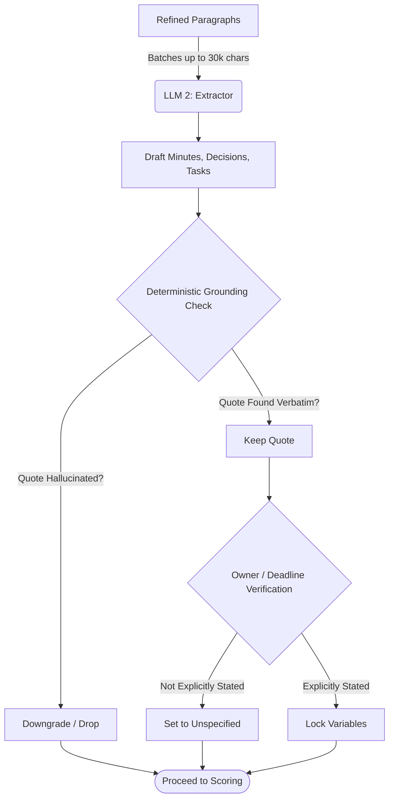
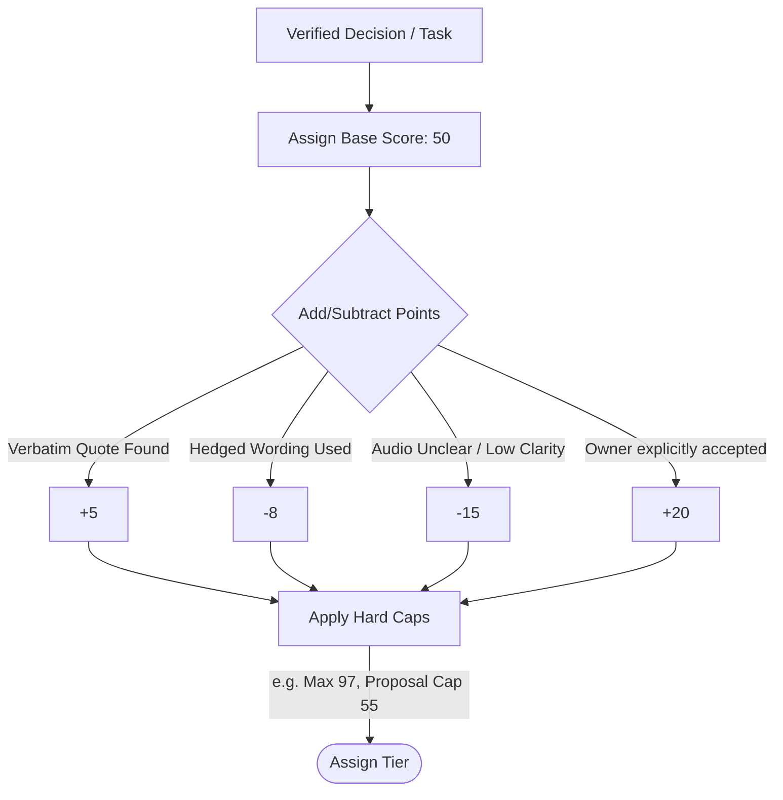

# 🎙️ AI Meeting Assistant 
*An intelligent, verifiable, and highly accurate meeting transcription and minutes extraction system.*

Welcome to the **AI Meeting Assistant**! This system is designed to take an English meeting recording and transform it into a flawless, perfectly grounded set of meeting minutes, decisions, and action items. 

Unlike standard AI summarizers, this tool ensures that **the model proposes, but deterministic code verifies**. Nothing the AI returns reaches you without passing strict, rule-based checks.

---

## 🎥 See it in Action
Check out our working prototype to see the pipeline in real-time!
- **YouTube Demonstration:** [Watch the Prototype Here](https://youtu.be/HjE0jAU74fA?si=uffV_EfjnziMiuHm)
- **Google Drive Video:** [View the High-Res Version Here](https://drive.google.com/file/d/15VfQNKmnkk1hBrsNG94sjvbs_-vBFsdI/view?usp=sharing)

---

## 📸 Interface Sneak Peek
Our Streamlit web app (`app.py`) provides an interactive interface to inspect every stage of the pipeline.

**Raw Transcript View:** The raw WhisperX output with speaker labels.
 

**Refined Transcript with Diffs:** See exactly what grammar or domain terms the system corrected.
 

**Domain Context & Briefing:** View the active dictionaries and phonetic matches.
 

**Action Items with Confidence:** Every task is assigned a confidence tier and clickable timestamp.
 

**Extracted Minutes & Decisions:** Beautifully formatted key decisions, completely grounded in audio quotes.
 

**Speaker Analytics:** Breakdown of speaker times and identified names.
 

---

## 🧠 Core Philosophy
We designed this architecture around three non-negotiable rules:
1. **The model proposes, deterministic code verifies.** We use a 72B language model (Qwen2.5-72B-Instruct) because it is fast and cheap, but we never let it hallucinate. Every change or extraction must pass a strict code-based check before reaching the user.
2. **Every claim keeps a pointer back to the audio.** Action items and decisions don't just appear out of thin air. They are stored with a verbatim quote, a clickable timestamp, and a calculated confidence tier.
3. **Missing means "Unspecified".** If the recording doesn't explicitly state a deadline, an owner, or a speaker's name, the system safely defaults to "Unspecified". 

---

## 🏗️ System Architecture Pipeline

The system processes data through four primary stages, orchestrated locally via a Streamlit interface, while utilizing Colab GPUs for heavy speech models and the OpenRouter API for LLM tasks. 

### Overall End-to-End Flow

### 1. Transcription Flow (`transcriber.py`)
This stage converts the raw media into perfectly aligned words.

*   **Intelligent Validation:** Checks for 15 supported formats, ensures the file isn't empty, and validates audio lengths (1s to 2h).
*   **Dynamic Resources:** Loads models optimally depending on whether a CPU or GPU is available, ensuring memory is freed after each model runs to protect modest hardware.
*   **Clarity Value:** Each paragraph receives a clarity score based on the Whisper `avg_logprob`, which is passed all the way down the pipeline to adjust later confidence scores.

### 2. Domain-Aware Refinement (`domain_kb.py` & `refiner.py`)
Language models often "fix" the wrong words, especially with niche jargon (e.g., changing "Kubernetes" to "cooper netties"). We use phonetic matching (Metaphone) and dictionaries to safely refine text.

*   **No Vector Database Needed:** We use custom dictionaries spanning software engineering, data science, local government, and formal meeting procedures.
*   **The Edit Validator:** Proposed edits are diffed word-by-word against the raw text. Changes to numbers, dates, negations, or modal verbs are instantly rejected.

### 3. Extraction & Grounding (`extractor.py`)
This is where the refined text turns into actionable meeting minutes.

*   **Zero Hallucination Tolerance:** If the LLM proposes an agreed decision, the system scans the raw text for the exact quote. If an explicit quote ("motion carried", "no objections") isn't found, the decision is downgraded to "proposed".

### 4. Confidence Scoring (`confidence.py`)
Instead of asking the LLM how confident it is (which is often poorly calibrated), we calculate it mechanically.

*   **Tiering System:** Final scores categorize items into Confirmed (80+), High chance (60-79), Ambiguous (40-59), or Low chance (<40).
*   **The 97% Ceiling:** We strictly cap maximum confidence at 97%. The system never claims 100% certainty, ensuring the user always feels encouraged to press the generated timestamp and listen to the audio themselves.

---

## 📦 Data Output & State Management
Our files do not share a messy global state. Each module passes a clean data object to the next, making the system highly testable. Ultimately, the interface generates a strictly tied JSON file and Markdown document—because they render from the exact same `MeetingRecord` object, the two formats can never contradict each other. All outputs, including full refinement reports and timestamped transcripts, are available to download as a `.zip` archive directly from the UI.